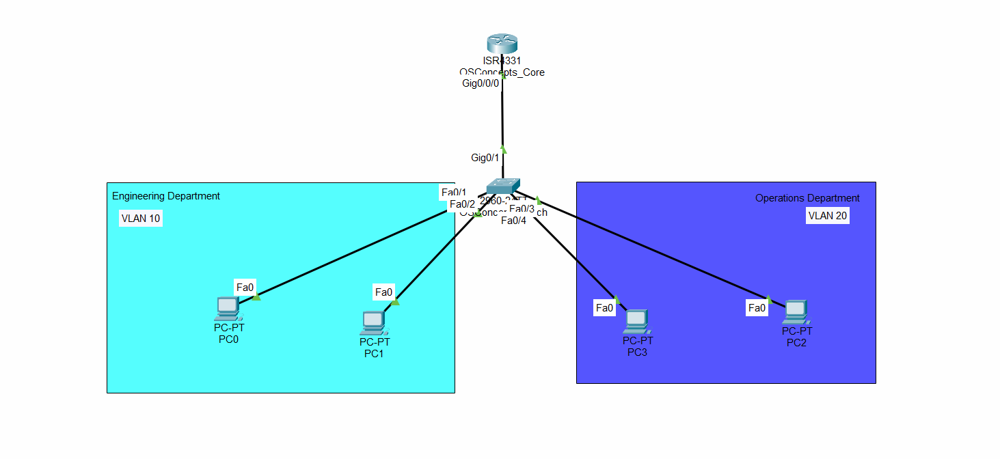

**Inter-VLAN Routing via Router-on-a-Stick (ROAS) Architecture**

**📌 Project Overview**

This project demonstrates the implementation of an Inter-VLAN routing network using the Router-on-a-Stick (ROAS) approach inside Cisco Packet Tracer. The objective was to segment a corporate network into distinct broadcast domains (VLANs) to optimize traffic control, enhance security, and scale network infrastructure efficiently using a single physical router interface.

**🛠️ Technical Specifications & Tools**

Software: Cisco Packet Tracer v8.x

Hardware Simulated: Cisco ISR 4331 Router, Cisco Catalyst 2960 Switch

Protocols: IEEE 802.1Q Encapsulation, VTP (VLAN Trunking Protocol), DHCP, ICMP

**🗺️ Topology Diagram**

**🎛️ Network Design Details**

**| VLAN ID | Department Name | IP Subnet Allocation | Default Gateway |**

|---------|-----------------|----------------------|-----------------|

| VLAN 10 | Engineering     | 192.168.10.0/24      | 192.168.10.1    |

| VLAN 20 | Administration  | 192.168.20.0/24      | 192.168.20.1    |

**🚀 Key Implementation Steps**

1. VLAN Creation & Access Assignment: Structured VLANs 10 and 20 on the Catalyst Switch and assigned access ports to designated host devices.

2. Trunking Configuration: Configured the uplink switch-to-router port as an 802.1Q trunk link to carry multi-VLAN traffic.

3. Subinterface Routing: Configured logical subinterfaces (`GigabitEthernet0/0/0.10`, `.20`) on the router, applying dot1q encapsulation matching each VLAN ID.

4. DHCP Services: Implemented localized router DHCP pools to dynamically allocate IP ranges per subnet.

🧪 Verification & Testing

Ping Tests: Successful end-to-end ICMP verification showing cross-VLAN communication.

Show Commands: Included complete output captures for `show ip route` and `show vlan brief` within the `/scripts` directory.

